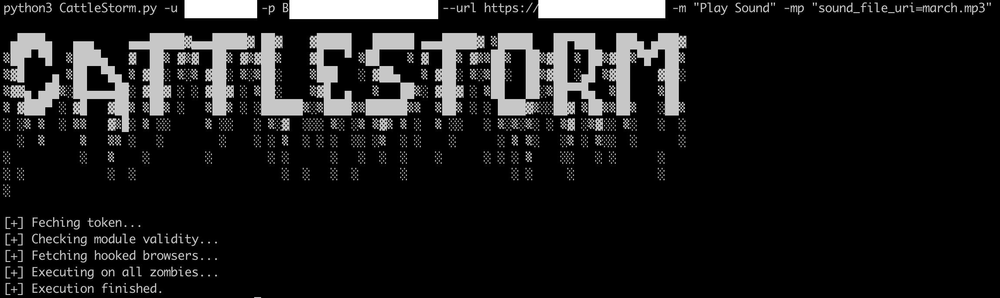

# CattleStorm
Python wrapper script to interact with the BeEF (https://github.com/beefproject/beef) API and execute modules on all connected zombie browsers at the same time. The script can execute any module by passing the module name, id or classname to it.

# Installation
```
git clone https://github.com/0xbad53c/CattleStorm.git
```

# Help
CattleStorm is a simple wrapper to execute BeEF modules on all connected, online browsers. There is currently no filter.
* Module names are listen in config.yaml files in the appropriate module subfolder in BeEF. e.g. beef/modules/browser/play_sound/config.yaml
* Parameter names can be found in command.js of the same module. e.g. var url = "<%== @sound_file_uri %>"; --> use "sound_file_uri=path/to/sound/file" as -mp value


# Execution example
The module parameters should be key=value pairs, separated with a comma. Wrap the entire -mp value in double quotes.
```
cd CattleStorm
python3 CattleStorm.py -u <beef-user> -p <beef-password> --url <beef-url> -m <module id/classname/name> -mp <module parameters>
```

